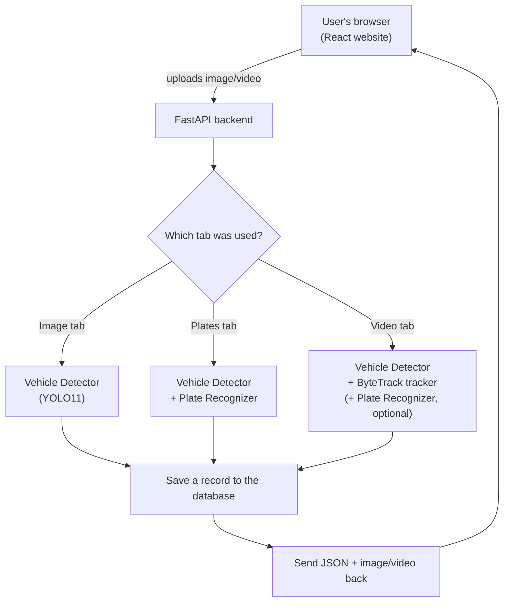

# Vehicle Detection & License Plate Recognition (Nepal)

A web app that looks at a photo or video of traffic and automatically:

1. **finds every vehicle** (car, motorcycle, bus, truck),
2. **draws a box around each one**, and
3. **reads the license plate** written on it — including Nepal's
   Devanagari-script government plates and the newer embossed
   English-letter private plates.

You upload a picture or a video clip through a website; a few seconds
later you get it back with boxes drawn on it and the plate numbers
typed out as text. This document explains **how**, in plain language,
with the actual code snippets that do each step — written up for a
class presentation, not just for developers.

---

## Table of contents

1. [The problem, in one sentence](#the-problem-in-one-sentence)
2. [What the finished app looks like](#what-the-finished-app-looks-like)
3. [The big picture: how a request flows through the system](#the-big-picture-how-a-request-flows-through-the-system)
4. [Tech stack, explained](#tech-stack-explained)
5. [Step 1 — Finding vehicles (object detection)](#step-1--finding-vehicles-object-detection)
6. [Step 2 — Following vehicles across a video (tracking)](#step-2--following-vehicles-across-a-video-tracking)
7. [Step 3 — Finding the license plate (a second detector)](#step-3--finding-the-license-plate-a-second-detector)
8. [Step 4 — Reading the plate text (OCR)](#step-4--reading-the-plate-text-ocr)
9. [Step 5 — Matching a plate to its vehicle](#step-5--matching-a-plate-to-its-vehicle)
10. [Step 6 — Rejecting things that only look like plates](#step-6--rejecting-things-that-only-look-like-plates)
11. [Saving results & history](#saving-results--history)
12. [The website (frontend) tour](#the-website-frontend-tour)
13. [API reference](#api-reference)
14. [Running it yourself](#running-it-yourself)
15. [Known limitations](#known-limitations)
16. [Glossary — jargon used above, explained](#glossary--jargon-used-above-explained)

---

## The problem, in one sentence

> Given a picture or video, automatically figure out *"what vehicles
> are here, and what do their number plates say?"* — a simplified
> version of the ANPR (**A**utomatic **N**umber **P**late
> **R**ecognition) systems used at toll booths and parking gates,
> adapted for Nepal's plate styles.

Nepal plates are harder for off-the-shelf tools than plates in most
countries most ANPR software was built for, for two reasons this
project had to solve specifically:

- **Script:** many plates are written in **Devanagari** (Nepali
  script), not the Latin alphabet generic OCR tools expect.
- **Font:** the characters are **embossed/stamped**, not printed —
  a blocky stencil font that even Devanagari-aware OCR (trained on
  printed documents) misreads.

## What the finished app looks like

The website has five tabs:

| Tab | What it does |
|---|---|
| **Image** | Upload a photo → get vehicle boxes + counts back. |
| **Plates** | Upload a photo → get vehicle boxes **and** plate boxes, with the plate text read out and matched to the right vehicle. |
| **Video** | Upload a video → get back an annotated video where every vehicle has a box and a tracking ID that stays the same across frames, optionally with plate text overlaid too. |
| **Gallery** | Browse thumbnails of past image/plate results. |
| **History** | A table of every detection run ever made (image, plate, or video), newest first, with a "download video" link where applicable. |

## The big picture: how a request flows through the system



Every upload is handled by one FastAPI backend written in Python. It
never talks to the internet for the actual detection — all the AI
models run locally, on the same machine as the server, using the CPU
(a GPU makes it faster but isn't required).

## Tech stack, explained

| Piece | What it actually is | Why it's here |
|---|---|---|
| **YOLO11** (`ultralytics`) | A neural network that looks at an image once and outputs "here are all the objects I see, and where" | Finds vehicles (and, separately, plates) in a single fast pass |
| **ByteTrack** | An algorithm that links "the car in frame 1" to "the same car in frame 2" | Gives each vehicle in a video a stable ID instead of detecting it fresh (and forgetting it) every single frame |
| **A custom CNN** (`char_classifier.py`) | A small neural network we trained ourselves from scratch | Reads individual plate characters far more accurately than generic OCR, because it was trained specifically on Nepali plate fonts |
| **EasyOCR** | A general-purpose, pretrained text-reading library | Backup reader, used only when the custom model isn't confident |
| **OpenCV (`cv2`)** | A classic image-processing library (no AI) | Reading video frame-by-frame, drawing boxes, cropping, thresholding |
| **FastAPI** | A Python web framework | Turns all of the above into HTTP endpoints a website can call |
| **SQLAlchemy + SQLite** | A database library + a simple file-based database | Remembers every past detection so the "History" tab has something to show |
| **ffmpeg** | A video-conversion command-line tool | Converts the processed video into a format web browsers can actually play |
| **React + TypeScript + Tailwind + Vite** | A modern website toolkit | The tabs, upload forms, and boxes-drawn-on-images you interact with |

---

## Step 1 — Finding vehicles (object detection)

The vehicle detector is **YOLO11** ("You Only Look Once", version 11)
— a small neural network (`yolo11n.pt`) that has already been trained
by its creators on millions of everyday photos (the COCO dataset) to
recognize 80 common object categories: people, dogs, chairs,
**cars, motorcycles, buses, trucks**, and more. This project doesn't
train YOLO itself — it just uses it, and only keeps the 4 vehicle
categories it cares about, throwing away "person", "dog", etc.

```python
# backend/app/services/vehicle_detector.py
VEHICLE_CLASSES = {2: "car", 3: "motorcycle", 5: "bus", 7: "truck"}

class VehicleDetector:
    def __init__(self, model_path="yolo11n.pt"):
        self.model = YOLO(model_path)

    def detect(self, image, vehicle_type="all"):
        results = self.model(image)          # run the neural network on the image
        detections = []

        for box in results[0].boxes:
            class_id = int(box.cls[0])
            if class_id not in VEHICLE_CLASSES:
                continue                       # not a car/bike/bus/truck — skip it

            x1, y1, x2, y2 = map(int, box.xyxy[0])   # the box's corner coordinates
            detections.append({
                "vehicle_type": VEHICLE_CLASSES[class_id],
                "confidence": round(float(box.conf[0]), 4),
                "bounding_box": {"x1": x1, "y1": y1, "x2": x2, "y2": y2},
            })

        return detections
```

**In plain terms:** feed the model a picture, it hands back a list of
rectangles, each labeled with *what* it thinks is inside the rectangle
and *how sure* it is (a confidence score from 0 to 1). The code above
just keeps the vehicle-shaped ones and converts them into a simple
list the rest of the app (and the website) can use.

## Step 2 — Following vehicles across a video (tracking)

A video is just many images (frames) shown quickly in sequence. If we
ran Step 1 on every frame independently, the same car would get
detected fresh each time with no memory that it's the *same* car —
useless for counting "how many unique vehicles passed by."

**ByteTrack** solves this: after YOLO finds the boxes in a frame, it
compares them to boxes from the *previous* frame (by position, size,
and motion) and assigns each one a persistent tracking ID.

```python
# backend/app/services/video_processor.py
results = self.model.track(
    frame,
    persist=True,            # remember tracked vehicles between frames
    tracker="bytetrack.yaml",
    classes=[2, 3, 5, 7],    # only car/motorcycle/bus/truck
)
```

`persist=True` is the key detail — it tells the tracker "don't forget
what you saw in the last frame." Every vehicle that gets a tracking ID
even once is counted toward `unique_vehicles` in the final result, so
a car that's on screen for 300 frames is still counted as **one**
vehicle, not 300.

## Step 3 — Finding the license plate (a second detector)

Once a vehicle's box is known, a **separate** YOLO model — trained
specifically to recognize plate-shaped rectangles instead of vehicles
— looks for a plate inside (or near) it.

This project actually runs **two** plate-detector models on every
image and merges their results, rather than trusting just one:

```python
# backend/app/services/plate_recognizer.py
DEFAULT_MODEL_PATHS = (
    "license_plate_detector.pt",         # general-purpose plate detector
    "license_plate_detector_nepal.pt",   # the same model, fine-tuned on Nepali plates
)
self.models = [YOLO(path) for path in model_paths]
```

**Why two models instead of one better model?** In testing, a
heavily fine-tuned model got very good scores on its own test data but
then latched onto a storefront sign as a "plate" on every frame of
real street footage — it had overfit to the narrow style of photos it
was trained on. A gentler fine-tune avoided that trap, but it then
missed some plates the original model still caught. Rather than
picking one imperfect model, **both run, and their answers are
combined** — if they agree (overlapping boxes), keep the more
confident one; if they disagree (each spots something the other
missed), keep both. Merging overlapping boxes like this is a standard
computer-vision technique called **Non-Maximum Suppression (NMS)**:

```python
def _merge_overlapping(self, candidates):
    remaining = sorted(candidates, key=lambda c: c["confidence"], reverse=True)
    kept = []
    while remaining:
        best = remaining.pop(0)             # take the most confident box left
        kept.append(best)
        remaining = [                       # drop anything that overlaps it too much
            c for c in remaining
            if self._iou(best["box"], c["box"]) < NMS_IOU_THRESHOLD
        ]
    return kept
```

`_iou` (**I**ntersection **o**ver **U**nion) is just "what fraction of
the two boxes' combined area do they share?" — a standard way to
measure how much two rectangles overlap, from 0 (no overlap) to 1
(identical box).

There's also a fallback for **close-up plate photos**: both models
were trained on scenes where a plate is a small part of a bigger
picture (the whole car is visible), so a photo that's *just* the
plate, filling the whole frame, confuses them (confidence collapses
to near-zero even though the plate is perfectly clear). The fix is
almost comically simple — add a plain border of padding around the
image and try again:

```python
def _detect_candidates_padded(self, image):
    pad = int(max(height, width) * 0.5)
    padded = cv2.copyMakeBorder(image, pad, pad, pad, pad, cv2.BORDER_REPLICATE)
    # ...run detection again on the padded version...
```

This alone took a real test plate from ~1% confidence to ~55%.

## Step 4 — Reading the plate text (OCR)

This is the hardest part of the whole project, and where most of the
custom engineering went. Generic OCR ("read the text in this image")
tools exist and are pretrained on Devanagari — but they're trained on
**printed or handwritten documents**, not the **blocky, embossed
stencil font** stamped into Nepali plates. No amount of resizing or
contrast-boosting fixed that; it's a font mismatch, not an image-quality
problem.

The solution: **train our own tiny neural network** that has only ever
seen real Nepali plate characters.

### 4a. Split the plate into individual characters

Before a neural network can classify a *character*, the plate image
has to be cut into individual character-sized pieces. This step uses
classical (non-AI) image processing, because Nepali plates are
high-contrast by design — dark stamped characters on a light
background (or vice versa) — which is exactly the case classic
thresholding handles well:

```python
# backend/app/services/char_classifier.py
def segment_characters(plate_crop):
    gray = cv2.cvtColor(plate_crop, cv2.COLOR_BGR2GRAY)

    # Otsu's method automatically finds the best black/white cutoff point
    _, binary = cv2.threshold(gray, 0, 255, cv2.THRESH_BINARY + cv2.THRESH_OTSU)

    # find each separate blob of "foreground" pixels — one per character
    contours, _ = cv2.findContours(binary, cv2.RETR_EXTERNAL, cv2.CHAIN_APPROX_SIMPLE)
    # ...filter out blobs that are the wrong size to be a character,
    #    then sort what's left into rows, left-to-right...
```

**In plain terms:** turn the plate into pure black-and-white, find
each separate blob of ink, throw out blobs too small/large/short to be
a real character (dust specks, screw holes, decorative borders), then
read the remaining blobs in natural reading order (row by row,
left to right).

### 4b. Classify each character with a small CNN

Each character blob gets resized to a tiny 32×32 pixel square and fed
through a **Convolutional Neural Network (CNN)** — this is the part
that was actually *trained* for this project (see
`backend/scripts/train_char_classifier.py`), on real, hand-labeled
Nepali plate character images:

```python
# backend/app/services/char_classifier.py
class CharClassifierCNN(nn.Module):
    """32x32 grayscale crop of one character in -> which of 64 possible
    characters it is, out."""

    def __init__(self, num_classes):
        super().__init__()
        self.features = nn.Sequential(
            nn.Conv2d(1, 32, 3, padding=1), nn.BatchNorm2d(32), nn.ReLU(), nn.MaxPool2d(2),
            nn.Conv2d(32, 64, 3, padding=1), nn.BatchNorm2d(64), nn.ReLU(), nn.MaxPool2d(2),
            nn.Conv2d(64, 128, 3, padding=1), nn.BatchNorm2d(128), nn.ReLU(), nn.MaxPool2d(2),
        )
        self.classifier = nn.Sequential(
            nn.Flatten(),
            nn.Linear(128 * 4 * 4, 256), nn.ReLU(), nn.Dropout(0.3),
            nn.Linear(256, num_classes),
        )
```

**In plain terms:** this is a standard, small image classifier — the
same basic recipe used to teach a computer to tell cats from dogs, just
aimed at "which of these 64 symbols is this?" instead. The 64 classes
cover:

- Devanagari digits (०–९) and the province/vehicle-category syllables
  used on government-style plates (e.g. "प्र", "बा", "को")
- Latin digits/letters used on the newer embossed private-vehicle
  plates
- a logo/watermark symbol that appears on some plates but isn't a
  character (so it can be recognized and *ignored*, not misread)
- a **`background`** class — explained in [Step 6](#step-6--rejecting-things-that-only-look-like-plates)

It was trained on ~30,000 real labeled character images from two
merged public datasets, reaching about **99.3% accuracy** on
characters it had never seen during training.

### 4c. Fall back to EasyOCR when unsure

The custom classifier is excellent on the plate styles it was trained
on, but it can only ever recognize the 64 things it learned. If it's
shown something genuinely unfamiliar (a different font style, a
plate style it's never seen), it should *say so* rather than guess
confidently and be wrong. So there's a safety net:

```python
# backend/app/services/plate_recognizer.py
def _read_text(self, plate_crop):
    if self.char_classifier is not None:
        text, confidence, is_background = self.char_classifier.read_plate_text(plate_crop)

        if is_background:
            return None, None, True                # not a plate at all — see Step 6

        if text is not None and confidence >= CHAR_CLASSIFIER_CONFIDENCE_THRESHOLD:
            return text, confidence, False          # trust the custom model

    # otherwise, fall back to the generic OCR library
    text, confidence = self._read_text_easyocr(plate_crop)
    return text, confidence, False
```

If the custom model's own average confidence across all the
characters it read comes back below 50%, the code doesn't trust it —
it hands the same plate crop to **EasyOCR** instead (upscaled 8× and
contrast-enhanced first, since plates in wide traffic shots are often
tiny). This matters in practice: an earlier version of the classifier
that only knew Devanagari would *confidently* (76% confidence)
misread an English-letter plate as garbled Devanagari text, instead of
recognizing "I don't know this." Teaching it to recognize its own
uncertainty — and adding the fallback — fixed that.

## Step 5 — Matching a plate to its vehicle

Detecting "a car" and detecting "a plate" happen independently — so
which plate belongs to which car? The answer: whichever vehicle box
the plate box overlaps the most.

```python
# backend/app/api/detection.py
def _match_plate_to_vehicle(plate_box, vehicles):
    plate_area = (plate_box["x2"] - plate_box["x1"]) * (plate_box["y2"] - plate_box["y1"])
    best_vehicle, best_overlap = None, 0.0

    for vehicle in vehicles:
        vb = vehicle["bounding_box"]
        # area where the plate box and this vehicle's box overlap
        intersection = ...
        overlap_ratio = intersection / plate_area

        if overlap_ratio > best_overlap:
            best_overlap, best_vehicle = overlap_ratio, vehicle

    # only a match if at least 50% of the plate box sits inside the vehicle box
    return best_vehicle if best_overlap >= 0.5 else None
```

A plate that doesn't sit substantially inside *any* detected vehicle
box (e.g. the vehicle detector missed that car, or it's a plate lying
on the ground) is reported separately as an "unmatched plate" rather
than silently dropped.

## Step 6 — Rejecting things that only look like plates

Testing against real, busy street photos (not clean close-up plate
shots) surfaced an important failure: the plate *detector* sometimes
proposes a box on things that **aren't** plates at all — a van's front
grille, a windshield glare, a motorcycle seat, a piece of fabric.
Worse, both text-reading paths would then confidently invent
plausible-looking gibberish text for these ("read" plate text on a
windshield!) instead of recognizing there was nothing there to read.

Neither the detector's confidence score nor the box's shape reliably
told real plates and these false alarms apart. The fix reuses the
character classifier from Step 4: it was **also** trained on real
photos of grilles/windshields/seats/fabric, run through the exact same
character-segmentation pipeline, and taught a `background` label for
"this blob isn't a character, it's just texture."

```python
# backend/app/services/char_classifier.py
background_count = sum(1 for label in labels if label == BACKGROUND_LABEL)

if background_count >= total_blobs - background_count:
    return None, None, True   # most segmented blobs look like texture, not text —
                               # this probably isn't a real plate; reject it
```

If most of what got segmented out of a candidate box looks like
texture rather than characters, the whole candidate is thrown away —
no box is drawn, no fake text is shown. This correctly caught 4 of 5
known false positives in testing. (One remaining case — a
motion-blurred taillight streak — has no character-like structure at
all for the classifier to even look at, so it isn't caught by this
particular fix; it's a known, documented gap, not a hidden one.)

---

## Saving results & history

Every detection run — image, plate, or video — is written to a small
SQLite database (`backend/detection_history.db`) via SQLAlchemy:

```python
# backend/app/models.py
class DetectionRecord(Base):
    __tablename__ = "detection_records"
    id = Column(Integer, primary_key=True)
    created_at = Column(DateTime, default=lambda: datetime.now(timezone.utc))
    source_type = Column(String)     # "image" / "plate" / "video"
    vehicle_type = Column(String)    # the filter used, e.g. "car" or "all"
    detections = Column(JSON)        # the full result, stored as-is
    unique_vehicles = Column(Integer)
    frames_processed = Column(Integer)
    download_url = Column(String)    # link to the processed video, if any
    image_url = Column(String)       # link to the annotated image, if any
```

This is what powers the **Gallery** (annotated images) and **History**
(everything, in a searchable table) tabs on the website — no
detection is ever re-run to display history, it's just read back from
this table.

## The website (frontend) tour

The frontend is a single-page React app. `App.tsx` is just a tab
switcher:

```tsx
// frontend/src/App.tsx
const TABS = [
  { id: "image", label: "Image", panel: ImageDetectionPanel },
  { id: "plate", label: "Plates", panel: PlateDetectionPanel },
  { id: "video", label: "Video", panel: VideoDetectionPanel },
  { id: "gallery", label: "Gallery", panel: GalleryPanel },
  { id: "history", label: "History", panel: HistoryPanel },
] as const;
```

Each tab is its own component (`frontend/src/panels/*.tsx`) that:

1. lets the user pick a file (`FileField`),
2. sends it to the backend via `fetch()` (`frontend/src/api.ts`),
3. draws the returned boxes on top of the image/video
   (`ImageWithBoxes`), color-coded per vehicle type.

```ts
// frontend/src/api.ts — a typical API call from the browser
export async function detectImage(file: File, vehicleType: VehicleType) {
  const formData = new FormData();
  formData.append("vehicle_type", vehicleType);
  formData.append("file", file);

  const response = await fetch("/api/detection/image", { method: "POST", body: formData });
  return response.json();
}
```

Nothing here is more exotic than a normal file-upload form — the AI
complexity is entirely on the backend; the frontend's job is just to
send the file, wait, and draw rectangles on the response.

## API reference

All endpoints live under `/api/detection`. Interactive, try-it-yourself
docs are auto-generated by FastAPI at `/docs` once the backend is
running.

| Endpoint | Method | What it does |
|---|---|---|
| `/image` | POST | Detect vehicles in an uploaded image. Optional `vehicle_type` filter. |
| `/plate` | POST | Detect vehicles **and** plates, matched and OCR'd. |
| `/video` | POST | Detect + track vehicles in a video; annotate and save it. `read_plates=true` also OCRs each tracked vehicle. |
| `/video/{filename}` | GET | Download/stream a processed video. |
| `/gallery/{filename}` | GET | Download/view an annotated image. |
| `/history` | GET | Recent detection records (`limit` query param). |
| `/health` | GET | Health check. |

## Running it yourself

**Backend:**

```bash
python3 -m venv .venv
source .venv/bin/activate

pip install torch torchvision --index-url https://download.pytorch.org/whl/cpu
pip install -r requirements.txt

cd backend
uvicorn app.main:app --reload
```

The vehicle model (`yolo11n.pt`) downloads automatically on first run.
The plate-detector weights and the character-classifier weights are
not committed to the repo (they're large, trained files) — see the
docstrings in `backend/scripts/finetune_plate_detector.py` and
`backend/scripts/train_char_classifier.py` for how to regenerate them,
or ask whoever set up the project for a copy. Without the character
classifier the app still works — it just falls back to EasyOCR-only
plate reading automatically.

**Frontend:**

```bash
cd frontend
npm install
npm run dev
```

Then open the printed local URL (typically `http://127.0.0.1:5173`) —
the dev server automatically forwards API calls to the backend on
port 8000.

## Known limitations

Being upfront about what this project **doesn't** do well is part of
presenting it honestly:

- **Tiny/far-away plates are hard for any OCR**, including this one.
  Real ANPR systems use dedicated close-range cameras for exactly this
  reason — a plate that's only 20 pixels wide in a wide traffic shot
  is below what any text reader can reliably work with.
- **Video plate-reading is deliberately throttled**, not run on every
  frame — EasyOCR takes 1-2 seconds per attempt on CPU, so each
  tracked vehicle is retried at most every 20 frames and gives up
  after 5 tries or once a confident reading is found. Turning on plate
  reading noticeably slows down video processing as a result.
- **No live camera / streaming support yet** — everything is
  "upload a file, wait, get a result back," not real-time video from a
  webcam.
- **The background-rejection tradeoff (Step 6)** occasionally rejects
  a *genuine* plate that's small, blurry, or under a decorative
  cover, alongside the false positives it's designed to catch — in
  testing, those particular plates were already unreadable either way,
  so no readable text is lost, but the box itself disappears rather
  than showing as "detected, unreadable."
- **`ffmpeg` must be installed** on the machine running the backend
  for processed videos to play inline in a browser; without it,
  videos still process successfully but only work as a direct
  download.

## Glossary — jargon used above, explained

| Term | Plain-English meaning |
|---|---|
| **Object detection** | Teaching a computer to answer "what's in this image, and where" — drawing a box around each thing it recognizes |
| **YOLO** | "You Only Look Once" — a fast, popular family of object-detection neural networks |
| **Bounding box** | The rectangle drawn around a detected object, given as two corner coordinates |
| **Confidence score** | How sure the model is about a detection, from 0 (not sure at all) to 1 (certain) |
| **Class / class ID** | The category a detection belongs to (e.g. "car"), represented internally as a number |
| **Tracking** | Linking the same real-world object across multiple video frames so it isn't re-counted as new every frame |
| **ByteTrack** | The specific tracking algorithm used here to keep a stable ID per vehicle |
| **OCR** | **O**ptical **C**haracter **R**ecognition — reading text out of an image |
| **CNN** | **C**onvolutional **N**eural **N**etwork — the standard type of neural network for recognizing images |
| **Otsu thresholding** | A classical (non-AI) algorithm that automatically picks the best cutoff to turn a grayscale image into pure black-and-white |
| **Connected components** | Groups of touching pixels treated as one "blob" — used here to find individual characters |
| **IoU (Intersection over Union)** | A 0-to-1 score for how much two rectangles overlap; 1 means identical, 0 means no overlap at all |
| **NMS (Non-Maximum Suppression)** | The technique of merging/removing overlapping detection boxes, keeping only the most confident one per real object |
| **Ensemble** | Running more than one model and combining their answers, instead of trusting a single model |
| **Fine-tuning** | Taking an already-trained model and training it a bit further on new, more specific data |
| **Overfitting** | When a model gets very good at its training data specifically, but fails to generalize to new, real-world examples |
| **Inference** | Actually *running* a trained model on new data (as opposed to training it) |
| **API endpoint** | A specific URL a program can send a request to, to get something done (e.g. `/api/detection/image`) |
| **Backend / frontend** | Backend = the server-side program doing the heavy lifting (Python here); frontend = the website the user actually sees and clicks on (React here) |
