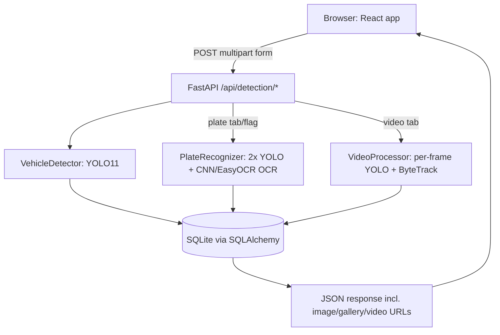

# Workflow

How this project is put together and how a request moves through it. For
the full narrative explanation (with code walkthroughs of the detection
pipeline), see `README.md` — this doc is the shorter, structural view.

## What the project is

A two-part web app: a **React frontend** for uploading images/video and
viewing results, and a **Python/FastAPI backend** that runs the actual
vehicle- and license-plate-detection models. It's built around Nepal's
license plates specifically (Devanagari script, embossed/stencil font),
which is why plate reading uses a custom-trained classifier instead of
relying on off-the-shelf OCR alone.

## Tech stack

| Layer | Tech |
|---|---|
| Frontend | React 19 + TypeScript, Vite, Tailwind CSS v4, oxlint |
| Backend | FastAPI (Python), Uvicorn, Pydantic / pydantic-settings |
| Vehicle detection | Ultralytics YOLO11 (`yolo11n.pt`, pretrained on COCO) |
| Video tracking | ByteTrack, via `model.track(..., persist=True)` |
| Plate detection | Two YOLO models (general + Nepal fine-tuned), merged with NMS/IoU |
| Plate OCR | Custom CNN (`char_classifier.py`, PyTorch) trained on ~30k labeled Nepali plate characters, with EasyOCR as a fallback |
| Image processing | OpenCV (`cv2`) — video I/O, cropping, thresholding, drawing boxes |
| Database | SQLAlchemy ORM over SQLite (`detection_history.db`) |
| Video output | ffmpeg (re-encodes tracked output so browsers can play it inline) |

## Repo layout

```
backend/
  app/
    main.py              FastAPI app setup, CORS, router mounting
    config.py            Settings (database URL, plate-match threshold)
    database.py          SQLAlchemy engine/session, schema migration helper
    models.py            DetectionRecord ORM model (the history table)
    api/detection.py     All /api/detection/* routes
    services/
      vehicle_detector.py   YOLO11 wrapper -> list of vehicle boxes
      plate_recognizer.py   Two-model plate detection + OCR orchestration
      char_classifier.py    Character segmentation + custom CNN classifier
      video_processor.py    Frame loop + ByteTrack + optional plate OCR
  scripts/               Offline training/fine-tuning scripts (not run by the app)
  results/, results/gallery/   Saved annotated videos/images served back to the frontend
  *.pt                   Model weights (YOLO + plate detectors; not all committed)
  char_classifier_labels.json   Index -> character label mapping for the CNN
  detection_history.db   SQLite database file

frontend/
  src/
    App.tsx              Tab switcher (Image / Plates / Video / Gallery / History)
    api.ts                fetch() wrappers for each backend endpoint
    panels/*.tsx          One component per tab, each owns its own upload+display flow
    components/           Shared UI: file picker, image-with-boxes overlay, etc.
  vite.config.ts          Dev server proxies /api -> http://127.0.0.1:8000
```

## Request flow



1. A panel component (`frontend/src/panels/*.tsx`) builds a `FormData`
   with the uploaded file (+ any options like `vehicle_type`,
   `read_plates`) and calls a helper in `api.ts`.
2. In dev, Vite proxies `/api/*` requests to the FastAPI server at
   `127.0.0.1:8000` (`vite.config.ts`), so the frontend just calls
   relative URLs.
3. The matching route in `backend/app/api/detection.py` decodes the
   upload with OpenCV, then runs the relevant service(s) — always inside
   `run_in_threadpool` so a slow CPU-bound model call doesn't block the
   FastAPI event loop for other requests.
4. **Image**: `VehicleDetector.detect()` runs YOLO11 once, filters to
   car/motorcycle/bus/truck, returns boxes + confidences.
5. **Plates**: vehicles are detected the same way, then
   `PlateRecognizer.read_plates()` runs two plate-detector models,
   merges overlapping boxes (NMS/IoU), OCRs each plate crop (custom CNN
   first, EasyOCR fallback, background-rejection to drop false
   positives), and each plate is matched to whichever vehicle box it
   overlaps ≥50% (`_match_plate_to_vehicle`).
6. **Video**: `VideoProcessor.process()` reads the file frame-by-frame
   with OpenCV, runs `model.track(..., tracker="bytetrack.yaml",
   persist=True)` so each vehicle keeps a stable ID across frames,
   optionally throttled plate OCR per tracked vehicle, writes an
   annotated `.mp4` to `backend/results/`, and returns counts.
7. Every run (image/plate/video) is persisted as a `DetectionRecord` row
   (`backend/app/models.py`) — this is what backs the **Gallery** (saved
   annotated images) and **History** (all past runs) tabs; those tabs
   never re-run detection, they just read the DB.
8. The response JSON (plus an image/gallery URL or a video download URL)
   goes back to the panel, which draws boxes over the media using
   `ImageWithBoxes`.

## ML concepts and models used

A rundown of every ML/CV technique in the pipeline, what kind of problem
each one is solving, and (where it applies) the actual layer structure.

| Stage | Concept | Type of problem | Model / algorithm |
|---|---|---|---|
| Vehicle detection | Object detection | Multi-class detection (localization + classification) | YOLO11-nano (pretrained on COCO, used as-is, no training done here) |
| Video tracking | Multi-object tracking | Data association across frames (not learned — heuristic matching) | ByteTrack (motion/IoU-based ID association) |
| Plate detection | Object detection | Single-class detection ("plate" vs. not) | Two YOLO models (general-purpose + Nepal fine-tune), combined via ensembling |
| Plate detection merge | Ensembling | Combining multiple models' outputs | Greedy NMS (IoU-based duplicate suppression) |
| Character segmentation | Classical image processing (no ML) | Binary thresholding + blob extraction | Otsu's method + connected components (OpenCV) |
| Character reading | Image classification | Multi-class, single-label (34–87 classes) | Custom CNN, trained from scratch (`char_classifier.py`) |
| False-positive plate rejection | Image classification (reused) | Binary decision derived from a multi-class classifier | Same CNN's `background` class + a majority-vote rule over segmented blobs |
| Generic OCR fallback | Text detection + recognition | Sequence recognition | EasyOCR (pretrained, not trained here) |

### Object detection (YOLO) — vehicles and plates

YOLO frames "find and label objects" as one regression+classification
problem solved in a single forward pass: the network divides the image
into a grid and, per grid cell, directly predicts bounding-box
coordinates, an objectness score, and a class-probability distribution.
This project doesn't touch YOLO's internal architecture — it consumes
it as a black box via `ultralytics.YOLO`, in three roles:

- **`yolo11n.pt`** — pretrained on COCO's 80 classes; only class IDs
  `2/3/5/7` (car/motorcycle/bus/truck) are kept (`constants.py`). This
  is **multi-class object detection**, used purely for inference — no
  training happens on this model in this project.
- **`license_plate_detector.pt`** + **`license_plate_detector_nepal.pt`**
  — both **single-class object detection** (the only class is "plate").
  The second is a **fine-tuned** copy of the first (see "Transfer
  learning" below), not a separate architecture.

### Transfer learning / fine-tuning — Nepal plate detector

`scripts/finetune_plate_detector.py` takes the already-trained
`license_plate_detector.pt` and continues training it on ~8,000 Nepali
vehicle photos, rather than training a detector from random weights.
Concretely:

- **Frozen backbone** (`freeze=10`): the first 10 layers — the general
  edge/texture/shape feature extractors — are locked and not updated;
  only the detection head adapts to Nepal-specific plate appearance.
- Low learning rate (`lr0=0.0003`), few epochs (`epochs=3`), AdamW
  optimizer.
- This is the standard transfer-learning trade-off: freezing preserves
  general features and avoids overfitting to a narrow fine-tuning set;
  a full unfrozen fine-tune was tried first and overfit badly (see
  README for the storefront-sign false-positive it caused).

### Ensembling + Non-Maximum Suppression — combining two plate detectors

Running two independently trained detectors and merging their outputs
is a classic **ensemble** technique. The merge itself is manual
**Non-Maximum Suppression (NMS)**:

1. Sort all candidate boxes (from both models) by confidence, descending.
2. Keep the highest-confidence box; drop every remaining box whose
   **IoU** (Intersection-over-Union) with it is ≥ 0.5 (same detection,
   different model).
3. Repeat on what's left — so boxes the two models disagree on (each
   catches a different real plate) both survive, and boxes they agree
   on collapse into one.

### Multi-object tracking — ByteTrack

Not a neural network — a data-association algorithm run every frame on
top of YOLO's raw detections. It matches this frame's boxes to the
previous frame's tracked boxes by position/size/motion overlap, and
assigns a persistent integer ID to each match. `persist=True` keeps its
internal track state alive across frames of the *same* video (see
`video_processor.py`'s locking notes — this state lives on the model
instance and isn't safe to share across concurrent videos).

### Classical image processing — character segmentation

Before any neural network sees a character, `segment_characters()` in
`char_classifier.py` splits a plate crop into individual character
blobs using **no learning at all**:

1. Grayscale conversion.
2. **Otsu's method** — automatically picks the black/white threshold
   that best separates a bimodal pixel-intensity histogram.
3. Polarity check — since character strokes always cover a minority of
   the plate's pixels, whichever binary class covers less than half the
   image is treated as foreground (handles both light-on-dark and
   dark-on-light plates without a model needing to learn this).
4. **Connected-component analysis** (`cv2.findContours`) — groups
   touching foreground pixels into blobs.
5. Size/height filtering to drop noise (screw holes, borders), then
   row-clustering by vertical center to support two-line plates, and
   left-to-right/top-to-bottom ordering for natural reading order.

### The custom CNN — architecture and classification type

`CharClassifierCNN` (PyTorch, `char_classifier.py`) is a small
**image classifier**: single 32×32 grayscale character crop in, one
label out of N (**multi-class, single-label classification** — softmax
over N classes, not multi-label). N is however many classes are in
`char_classifier_labels.json` (Devanagari digits/syllables, Latin
digits/letters, a logo/watermark class, and the `background` class).

```
Input: 1 × 32 × 32 (grayscale)

Block 1: Conv2d(1  → 32,  kernel 3×3, pad 1) → BatchNorm2d → ReLU → MaxPool2d(2×2)   # 32×32 → 16×16
Block 2: Conv2d(32 → 64,  kernel 3×3, pad 1) → BatchNorm2d → ReLU → MaxPool2d(2×2)   # 16×16 → 8×8
Block 3: Conv2d(64 → 128, kernel 3×3, pad 1) → BatchNorm2d → ReLU → MaxPool2d(2×2)   # 8×8   → 4×4

Flatten → Linear(128*4*4 → 256) → ReLU → Dropout(0.3) → Linear(256 → num_classes)
```

This is a standard small **CNN classifier** shape: each conv block
doubles channel depth (32→64→128) while halving spatial resolution
(the pooling layers), so early layers learn low-level strokes/edges and
later layers learn more abstract character shapes; `BatchNorm` +
`ReLU` are the standard normalization/nonlinearity pairing per block;
`Dropout(0.3)` before the final linear layer regularizes against
overfitting on a training set that's tens of thousands of images, not
millions. Output is raw logits over `num_classes`; `PlateRecognizer`/
`CharClassifier` apply `softmax` and take the arg-max as the predicted
label, its probability as the confidence.

**Training** (`scripts/train_char_classifier.py`): supervised learning,
cross-entropy loss, Adam optimizer (lr 1e-3) with step-decay scheduling
(halve every 6 epochs), 15 epochs, 85/15 train/val split. Data
augmentation (random affine rotation/translation/scale + color jitter)
is applied only to the training split, simulating real photographic
variation; only the best-validation-accuracy checkpoint is kept.
Reaches ~99.3% held-out validation accuracy.

### Reusing a classifier for a different decision — background rejection

The `background` class isn't just another label — it's how a
**multi-class classification model gets reused to answer a binary
question** ("is this actually a plate?") that it was never directly
trained to answer as such. The rule in `read_plate_text()`: if at least
half of a candidate's segmented blobs are classified `background`,
reject the whole candidate rather than assembling text from it. This
is a **majority-vote heuristic on top of per-blob classification
outputs**, not a separately trained binary classifier.

### Generic OCR fallback — EasyOCR

Used only when the custom CNN doesn't apply or isn't confident
(`CHAR_CLASSIFIER_CONFIDENCE_THRESHOLD = 0.5`). EasyOCR is a pretrained
**text detection + sequence recognition** pipeline (its own internal
detector finds text regions, then a recognition model reads character
sequences from them) — used entirely as a black box; nothing in this
project retrains or fine-tunes it. Preprocessing before handing it a
crop: 8× Lanczos upscaling + grayscale + CLAHE contrast enhancement,
since plate crops in wide traffic shots are often very small.

## Local dev workflow

```bash
# backend
python3 -m venv .venv && source .venv/bin/activate
pip install torch torchvision --index-url https://download.pytorch.org/whl/cpu
pip install -r requirements.txt
cd backend && uvicorn app.main:app --reload      # http://127.0.0.1:8000

# frontend (separate terminal)
cd frontend
npm install
npm run dev                                       # http://127.0.0.1:5173, proxies /api to :8000
```

- `yolo11n.pt` auto-downloads on first run via `ultralytics`.
- The plate-detector and char-classifier weights are large trained
  files and aren't all committed — without them the app still works,
  falling back to EasyOCR-only plate reading.
- `ffmpeg` needs to be installed system-wide for processed videos to
  play inline in the browser (otherwise they still process, just
  download-only).
- Interactive API docs are auto-generated by FastAPI at `/docs`.
 